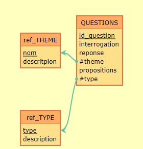

# Database

## 🧐 About <a name = "about"></a>
This document is a guide to explain the conception of the database and how to use it.

## 🏁 Getting Started <a name = "getting_started"></a>
To use the database, you need to install the following software:
- [Mysql](https://www.mysql.com/fr/)

### Start
To launch the database, you need to run the following commands:
```bash
mysql -u root -p
```  

After, you need to create the database:
```bash
CREATE DATABASE IF NOT EXISTS `QUIZZ`;
```  

Then, you need to create the tables:
```bash
source sql/init.sql
```  

## MCD


You can copy past this code in [mocodo](https://www.mocodo.net) to see the MCD:  
```
:
:

ref_CATEGORIE: nom, descritpion
QUESTIONS: id, question, reponse, #categorie->ref_CATEGORIE->nom, propositions, #type->ref_TYPE->type

:
:

:
ref_TYPE: type, description
:
:
```
