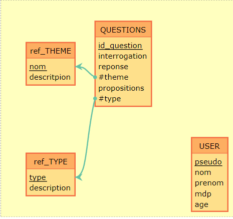

# Database

## 🧐 About <a name = "about"></a>
This document is a guide to explain the conception of the database and how to use it.

## 🏁 Getting Started <a name = "getting_started"></a>
To use the database, you need to install the following software:
- [docker](https://www.docker.com/)
- [docker-compose](https://docs.docker.com/compose/)

### Start
To launch the database, you need to run the following commands:
```bash
bash startBd.sh
```

## Explication
The database is create on docker mysql. During the creation of the container, init script is launch. This script create the database, the tables and users with there privileges. The script is in the folder `./database/init.sql`.

## MCD


You can copy past this code in [mocodo](https://www.mocodo.net) to see the MCD:  
```
:
:

ref_CATEGORIE: nom, descritpion
QUESTIONS: id, question, reponse, #categorie->ref_CATEGORIE->nom, propositions, #type->ref_TYPE->type

:
:

:
ref_TYPE: type, description
:
:
```

## To do
- [ ] Create trigger for chek if this question already exist